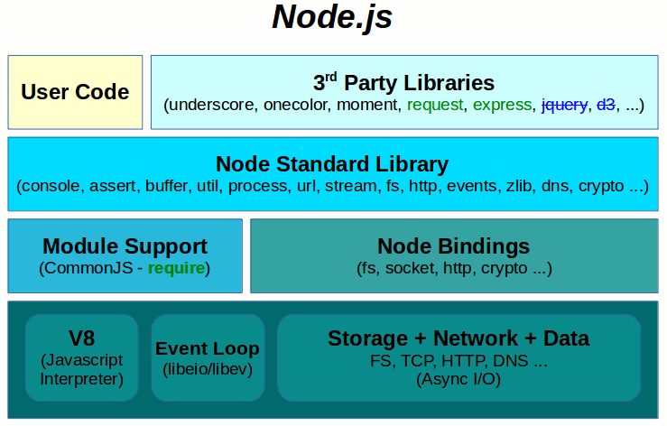
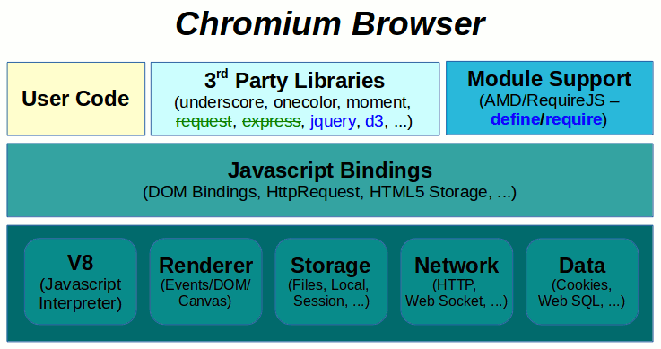
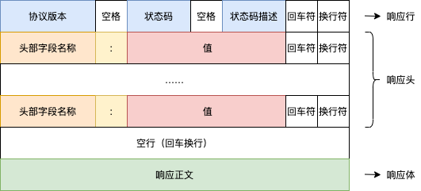

# 1-使用 Node.js 构建一个 Web 服务端程序

[toc]

## 1、Node.js的安装与基础语法

> 录播内容

------------------------------------------------


## 2、Node.js 中的 JavaScript 与 浏览器中的 JavaScript

### 2-1、Node.js 中的 JavaScript




### 2-2、浏览器 中的 JavaScript




## 3、什么是 WebServer(APP)？

`WebServer` ，也称为 `网页服务器` ，通俗来讲就是提供 网页浏览器服务的机器。

通常 `Web资源` （html、css、js、images……）都会存放在一个指定的 服务器 中，然后通过特定的软件 （`WebServer APP`），如 `Apache、Nginx、IIS……` ，来提供访问服务。

**访问模式**

首先由客户端（浏览器）发送一个请求，通过网络连接到提供 `Web服务` 的机器，`WebServer APP` 会监听到客户端请求，并根据请求作出处理，返回对应的资源。


## 4、如何构建一个基于网络的应用程序？

无论使用什么语言（C、C++、Java、Node.js……），只要具备调用底层网络 API 的能力，那么就能实现基于网络的应用程序。

`作为服务端`，主要通过监听指定的主机（IP）& 端口来获取请求的数据，然后根据具体的业务逻辑处理再通过网络返回数据。

`作为客户端`，就是通过网络发送请求数据，并通过网络获取到服务端返回的数据。


## 5、使用 Node.js 搭建一个 WebServer APP

### 5-1、Node.js 中的 net 模块

> 参考：https://nodejs.org/dist/latest-v15.x/docs/api/net.html

### 5-2、Node.js 中的 http 模块

> 参考：https://nodejs.org/dist/latest-v15.x/docs/api/http.html

该模块使用 `net` 模块实现了基于 `http` 协议的各种 API。

#### 核心类

**Agent**

该对象用来管理和维护客户端连接的持久性和重用，应用于客户端应用程序中（类似如：浏览器、postman等）。

**ClientRequest**

创建一个客户端连接对象，实现请求逻辑，应用于客户端。

**Server**

创建一个服务端对象，用于监听、处理客户端的请求，应用于服务端应用中。

**ServerResponse**

提供服务端响应相关的各种 API，应用于服务端（如：设置响应头信息，返回响应数据等）。

**IncomingMessage**

提供获取来源（Server中来源于Client的请求，Client中来源于Server的响应）信息的各种 API，应用于服务端（如：获取客户端当前请求的方法、URL、头信息等）。

**Others**

除此之外，该模块还提供了许多应用中需要用到的各种 **属性** （如：METHODS、STATUS_CODES、maxHeaderSize 等）和 **方法** （如：createServer、request 等）。

### 5-3、使用 http.Server 类创建一个基于 http 协议的 webServer 对象

```javascript
// #C5-3-1
// 使用 Node.js 内置 require 方法引入核心模块 -> http
const http = require('http');

// 创建一个 Server 对象
const server = new http.Server();

// 也可以使用 createServer 方法创建一个 Server 对象
const server = http.createServer();
```

> `http` 模块源码参考：Node.js 源码参考：https://github.com/nodejs/node/blob/v15.14.0/lib/http.js

### 5-4、主机与端口

```javascript
// #C5-4-1
const http = require('http');

const server = http.createServer();

// 指定当前 Server 需要监听的主机
server.listen(8888, '0.0.0.0');
```

**参数**

- 第一个参数表示端口，如果省略或为0，讲默认分配一个未被使用的端口。
  - 端口取值范围：1-65535。
- 第二个参数表示主机（IP），省略的时候，当 IPv6 可用时值为：`'::'` ，否则为 IPv4 的地址：`'0.0.0.0'` 。
  - `'0.0.0.0'` 表示主机所有可用的 IP。

> 参考：https://nodejs.org/dist/latest-v15.x/docs/api/http.html#http_server_listen

### 5-5、使用事件回调处理请求

```javascript
// #C5-5-1

const http = require('http');

const server = http.createServer();

// 注册 request 事件回调函数，当有客户端连接请求被监听到的时候执行回调
server.on('request', () => {
  console.log(`有客户端请求`);
});

server.listen(8888, '0.0.0.0');
```

> 参考：https://nodejs.org/dist/latest-v15.x/docs/api/http.html#http_event_request


## 6、返回响应数据（资源）

### 6-1、使用 http.ServerResponse 类实例处理响应数据（资源）

 在每一次的 `request` 事件中回调函数中会通过参数注入两个对象：

- 第一个参数： `IncomingMessage` 对象。
- 第二个参数：`ServerResponse` 对象。

我们可以使用 第二个参数 `ServerResponse` 对象来向客户端返回数据。

```javascript
// 基于 #C5-5-1
// #C6-6-1

...

server.on('request', (req, res) => {
  console.log(`有客户端请求`);
  
  // 写入数据
  res.write('Hello');
  // 结束数据写入
  res.end();
  
  // 也可以直接调用
  res.end('Hello');
});

...
```

> 参考：https://nodejs.org/dist/latest-v15.x/docs/api/http.html#http_class_http_serverresponse

## 7、多资源定位

### 7-1、使用 URI(URL) 定位不同的资源

> 参考：https://developer.mozilla.org/zh-CN/docs/Glossary/URL

访问上面那个 URL ，你就可以看到关于 URL 的详细资料。


## 8、获取请求信息

### 8-1、使用 http.IncomingMessage 类实例获取客户端请求信息

```javascript
// 基于 #C6-6-1
// #C8-8-1

...

server.on('request', (req, res) => {
  console.log(`有客户端请求`);
  
  // 获取请求相关信息
  // 当前请求的 url 字符串
  console.log(req.url);
  
  // 写入数据
  res.write('Hello');
  // 结束数据写入
  res.end();
});

...
```

> 参考：https://nodejs.org/dist/latest-v15.x/docs/api/http.html#http_class_http_incomingmessage


## 9、URL 字符串解析

### 9-1、使用 Node.js 中的 URL 模块解析 URL 字符串

```javascript
// 基于 #C8-8-1
// #C9-9-1
...

const url = require('url');

...


server.on('request', (req, res) => {
  console.log(`有客户端请求`);
  
  // 获取请求相关信息
  // 当前请求的 url 字符串
  console.log(req.url);
  
  // 使用 Node.js 的 url 模块中提供的工具方法解析 url 字符串
  const urlObj = url.parse(req.url);
  console.log(urlObj);
  
  // 写入数据
  res.write('Hello');
  // 结束数据写入
  res.end();
});

...
```

### 9-2、使用 WHATWG（HTML5） 中的 URL API 解析 URL 字符串

```javascript
// 基于 #C8-8-1
// #C9-9-2

// const URL = require('url').URL; // 不需要引入
...


server.on('request', (req, res) => {
  console.log(`有客户端请求`);
  
  // 获取请求相关信息
  // 当前请求的 url 字符串
  console.log(req.url);
  
  // 使用 WHATWG（HTML5） 中的 URL API 解析 URL 字符串
  const urlObj = new URL(req.url);
  console.log(urlObj);
  
  // 写入数据
  res.write('Hello');
  // 结束数据写入
  res.end();
});

...
```

> 参考：https://nodejs.org/dist/latest-v15.x/docs/api/url.html#


## 10、静态资源

### 10-1、静态资源与动态资源

通俗来讲（广义），`静态资源` 指的是通过资源地址（URL）访问到的内容就是资源内容本身，不经过程序的特殊处理（如：逻辑判断处理、数据库读取、随机内容等……），一般我们把网站的 `HTML文件、CSS文件、JS文件、图片文件` 等称为静态资源。对于静态资源，我们如果不去修改这些静态资源本身的内容，那么通过同一个 URL 在任何时候看到的内容应该不变的。

而动态资源正好与之相反。

```javascript
// #C10-10-1
...
server.on('request', (req, res) => {
  // 静态资源
  res.end('Hello');
  
  // 动态资源
  res.end( new Date() );
})
...
```

### 10-2、静态资源优化

通常，我们会把静态特性的资源存储到其它媒介（硬盘文件）中，在需要访问的时候根据一些规则（WebServerAPP自定义）进行读取访问，这样的好处：

- 方便管理维护
- 方便修改

```javascript
// #C10-10-1
...
server.on('request', (req, res) => {
  // 1、获取当前客户端请求的url
  // 2、解析 url 字符串
  // 3、获取 url 中 path 部分的值
  // 4、根据 path 中的读取我们存放在硬盘中的对应资源文件
  // 5、把读取到的资源文件内容作为响应内容返回给客户端
});
...
```

> 问题！！！
>
> - 不同类型的资源内容（如：html、css、image……）在客户端接收到以后可能会无法正确被处理。

## 11、HTTP 协议

### 11-1、协议的定义

`HTTP` 是一种能够获取如 HTML 这样的网络资源的 protocol(通讯协议)。它是在 Web 上进行数据交换的基础，是一种 client-server 协议，也就是说，请求通常是由像浏览器这样的接受方发起的。一个完整的Web文档通常是由不同的子文档拼接而成的，像是文本、布局描述、图片、视频、脚本等等。（来源：https://developer.mozilla.org/zh-CN/docs/Web/HTTP/Overview）。

无论是客户端请求还是服务端响应，本质就是在交换数据。因为交换的数据的多样性，为了能够让双方正确的理解和处理交换的数据，就需要给这些数据定义一些交换的方式和格式，这就是 `HTTP` 协议的基本作用。

> 一些参考资料：
>
> - https://tools.ietf.org/html/rfc2616

### 11-2、报文

**报文** 可以理解为交换的数据，在 `HTTP` 协议中规定了交换的格式，报文分为：

- 请求报文
- 响应报文

#### 请求报文


#### 响应报文



#### HTTP Headers

`HTTP Headers` 允许客户端和服务端在请求和响应的时候携带一些附加信息，客户端会根据不同的头信息字段和对应内容做出不同的操作。根据不同的上下文环境，`HTTP Headers` 可分为：

- **General Headers** : 普通头，同时适用于请求和响应消息，但与最终消息主体中传输的数据无关的消息头。
  - 参考：https://developer.mozilla.org/en-US/docs/Glossary/General_header
- **Request Headers** : 请求头，包含更多有关要获取的资源或客户端本身信息的消息头。
  - 参考：https://developer.mozilla.org/en-US/docs/Glossary/Request_header
- **Response Headers** : 包含有关响应的补充信息，如其位置或服务器本身（名称和版本等）的消息头。
  - 参考：https://developer.mozilla.org/en-US/docs/Glossary/Response_header
- **Entity Headers** : 包含有关实体主体的更多信息，比如主体长(Content-Length)度或其MIME类型。
  - 参考：https://developer.mozilla.org/en-US/docs/Glossary/Entity_header

> 参考：https://tools.ietf.org/html/rfc4229#section-2.1.32

## 12、不同类型资源的处理

无论是请求还是响应，都会涉及到各种不同类型的资源要进行处理。为了能够让接收方（注：请求的接收方是服务端、响应的接收方是客户端）知道当前接收到内容类型，以便针对该类型进行对应的处理，所以需要在发送正文数据的同时需要同时告知该正文内容的类型格式。

### 12-1、使用 content-type 响应头返回资源类型

`Content-Type` 用于说明请求或相应中正文内容的 `MIME` 类型。

### 12-2、MIME 的作用与使用

`MIME（Multipurpose Internet Mail Extensions）` : 是一种用来表示 文档、文字或字节流的性质和格式的标准。

**结构**

`MIME` 的通用结构为 : `type/subtype` ，`type` 为大类，`subtype` 为小类，如：`text/html`、`text/css`、`image/png` 等。

>  参考：https://www.iana.org/assignments/media-types/media-types.xhtml

### 12-3、设置响应头

使用 `http` 模块提供的 `setHeader` 方法就可以向响应中设置对应的头信息。

```javascript
// #C12-3-1
...
server.on('request', (req, res) => {
  res.setHeader('Content-Type', 'text/html;charset="utf-8"');
});
...
```


## 13、动态资源

许多时候，服务端还可能会提供一些动态处理的资源，比如会根据当前时间，当前客户端访问用户的身份权限等条件进行一些逻辑处理后返回对应的资源，这个时候，针对同一个 URL 的请求可能会产生不一样的结果，这种资源我们可以成为：`动态资源` 。

### 13-1、使用 URL 路由表优化动态资源处理

因为动态资源的特性，资源并不能像静态资源一样简单的存储在一个外部文件中，然后使用一个 URL 与之关联。所以，针对这种资源，通常情况下，我们需要对不同的 URL 进行不同的处理。

- 把不同的 URL 对应的一些逻辑分别保存（通常是函数）。
- 准备一个路由表（可以使用对象格式进行存储，key是 URL，value是对应的函数）。
- 根据当前访问的 URL ，找到路由表中的对应的函数并执行。

```javascript
// #C13-1-1
...
// 路由表
const routesMap = new Map();
routesMap.set('/', async (req, res) => {
  res.setHeader('Content-Type', 'text/html;charset="utf-8"');
  res.end('首页');
});
routesMap.set('/list', async (req, res) => {
  res.setHeader('Content-Type', 'text/html;charset="utf-8"');
  res.end('列表');
});

server.on('request', async (req, res) => {
  ...
  const urlObj = new URL(req.url);
  ...
  
  const pathname = urlObj.pathname;
  
  // 根据当前的 pathname 指定 routeMap 中对应的函数
  let routeHandler = routesMap.get(pathname);
  if (routeHandler) {
      await routeHandler(req, res);
  }
});
...
```

### 13-2、URL 重定向

我们通过一个 `重定向` 的需求应用场景来加深一下关于协议（如 `http` 头）等相关知识的理解

**需求** : 访问不存在的 URL ，重新定向到 / 路由。

#### 13-2-1、HTTP 状态码

我们通常在访问出现一些问题的时候返回一个友好的页面（或数据）给客户端，但是客户端仅仅从页面（数据）本身是无法知道这个页面（或数据）是这次请求本身应该对应的数据，还是我们给他的一个错误提示，这个时候就可以在响应的同时返回一个称为：`状态码` 的内容给客户端，它由一组具有特定含义的数字组成：

- 信息响应(`100`–`199`)
- 成功响应(`200`–`299`)
- 重定向(`300`–`399`)
- 客户端错误(`400`–`499`)
- 服务器错误 (`500`–`599`)

> 注：虽然服务端可以随意返回指定的状态码，但是我们应当按照实际的情况返回标准中定义好的状态码。
>
> 参考：https://developer.mozilla.org/zh-CN/docs/Web/HTTP/Status
>
> 参考：https://tools.ietf.org/html/rfc2616#section-10

```javascript
// #C13-2-1-1
...
// 路由表
...

server.on('request', async (req, res) => {
  ...
  const urlObj = new URL(req.url);
  ...
  
  const pathname = urlObj.pathname;
  
  // 根据当前的 pathname 指定 routeMap 中对应的函数
  let routeHandler = routesMap.get(pathname);
  if (routeHandler) {
      await routeHandler(req, res);
  } else {
    // 告知客户端你应该重新发送请求，新的请求地址在 Location 头中。
    res.statusCode = 302;
    res.setHeader('Location', '/');
    res.end();
  }
});
...
```

### 13-3、404 Not Found

`404` 也是我们经常听到的一个词，它其实就是状态码中的一种

**404** : 请求失败，请求所希望得到的资源未被在服务器上发现。

```javascript
// #C13-3-1
...
// 路由表
...

server.on('request', async (req, res) => {
  ...
  const urlObj = new URL(req.url);
  ...
  
  const pathname = urlObj.pathname;
  
  // 根据当前的 pathname 指定 routeMap 中对应的函数
  let routeHandler = routesMap.get(pathname);
  if (routeHandler) {
      await routeHandler(req, res);
  } else {
    // 返回一个404的状态码与提示页面
    res.statusCode = 404;
    res.end('<h1>页面丢失了</h1>');
  }
});
...
```


## 14、后端渲染

### 14-1、数据与视图

除了一些静态文件数据以外，服务端还会通过诸如：`数据库`、`程序运算` 等各种方式产生数据，同时我们又需要把这些数据通过页面（HTML，CSS）的方式进行组织（也就是试图）返回给客户端。

```javascript
// #C14-1-1
...

let users = [
  {id: 1, username: '大海'},
  {id: 2, username: '子鼠'},
  {id: 3, username: '小蕊'},
];

// 路由表
const routesMap = new Map();
routesMap.set('/', async (req, res) => {
  res.setHeader('Content-Type', 'text/html;charset="utf-8"');
  res.end(`
      <ul>
        ${users.map(u => {
          return `<li>${u.username}</li>`
        }).join('')}
      </ul>
  `);
});
...

server.on('request', async (req, res) => {
  ...
});
...
```

### 14-2、数据与视图分离

如果视图内容直接写在后端程序中，后端程序不好维护，且前端不好配合。

我们可以把前端相关的内容提取到外部文件中，在利用 `Node.js` 的 `fs` 模块进行文件读取，并进行一些简单的替换。

```javascript
// #C14-2-1
...
const fs = require('fs');

// 数据
...

// 路由表
const routesMap = new Map();
routesMap.set('/', async (req, res) => {
  res.setHeader('Content-Type', 'text/html;charset="utf-8"');
  let userListHtml = users.map(u => {
          return `<li>${u.username}</li>`
        }).join('');
  res.end( fs.readFileSync('./template/index.html').toString().replace(/${users}/gi, userListHtml) );
});
...

server.on('request', async (req, res) => {
  ...
});
...
```

`./template/index.html`

```html
// #C14-2-2
...
<ul>${users}</ul>
...
```

**模板** : 未被处理过的原始文件（如这里的：`./template/index.html`）。

**视图** : 通过模板与数据和逻辑的处理生成的最终内容。

### 14-3、使用模板引擎优化渲染

以上的模板数据解析替换方式太简单，复杂一些的视图逻辑就不太方便了。这个时候我们就可以使用一些 `模板引擎（功能更加强大的模板解析替换库）` 来完成解析工作。 

#### 14-3-1、基于 `JavaScript` 的常用模板引擎

- ejs
- artTemplate
- Nunjucks

#### 14-3-2、Nunjucks

> 参考：http://mozilla.github.io/nunjucks/

## 15、案例：基于 Node.js 构建一个商城应用