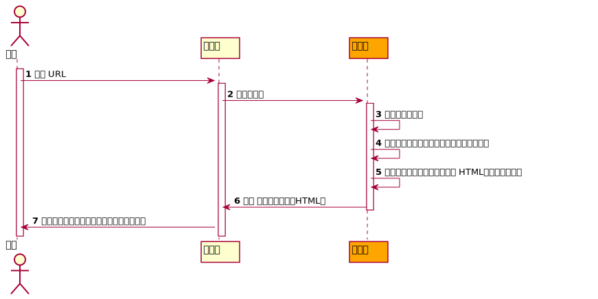
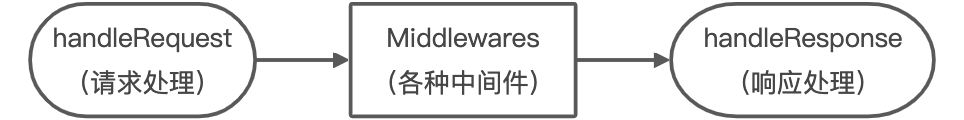
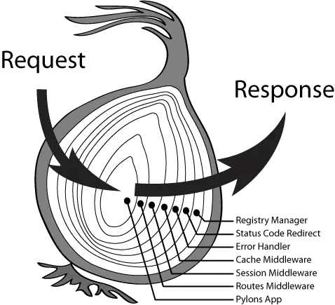

# 2-基于 Koa 框架的 WebServer 构建与原理解析

[toc]


## 1、NPM 的安装与使用

> 录播


## 2、框架

通过前面的基础学习，我们了解了基于 Web 的应用基本流程：



通过上图不难发现，无论具体应用功能如何变化， `服务端` 处理任务核心三个步骤：③、④、⑤ 中，③ 和 ⑤ 的模式基本是固定的（因为HTTP协议规范了），而 ④ 是最大的变量。

如果我们每次开发一个新的应用都要把 ③ 和 ⑤ 的逻辑重新实现一遍就会特别的麻烦。所以，我们可以封装一个框架（库）把 ③ 和 ⑤ 的逻辑进行统一处理，然后通过某种方式，把 ④ 的处理暴露给框架使用者。


## 3、KOA的设计思想

- 基于 NodeJS 的 web 框架，致力于 web 应用和 API 开发。
- 由 Express 原班人马打造。
- 支持 async。
- 更小、更灵活、更优雅。

> 官网：https://koajs.com/
>
> 中文：https://koa.bootcss.com/


## 4、KOA的安装

```shell
# 安装 koa
npm i koa

# 或者
yarn add koa
```

> 当前最新 Koa 依赖 node v7.6.0+、ES2015+ 以及 async 的支持。
>
> 具体请关注官网说明（依赖会随着版本的变化而变化）。
>
> 参考：https://koajs.com/#introduction


## 5、WebServer的创建

```javascript
// #C5-1-1
// require koa
const Koa = require('koa');

// 初始化一个 koa 对象（Application）
const app = new Koa();

// 使用 app 对象来创建一个 webserver
/**
 * http.createServer((req, res) => {})
 *
 * (new Http.Server().on('request', (req, res) => {}))
 */
app.listen(8888);
```


## 6、中间件



**中间件**

在 `Koa` 中，`中间件` 本质上就是用来完成各种具体业务逻辑的函数。`Koa` 的 `Application` 对象使用一个 `middleware` 来存储各种中间件函数。

### 6-1、注册中间件

中间件函数我们需要通过 `Application` 的 `use` 方法来进行注册：

```javascript
// #C6-1-1
const Koa = require('koa');

const app = new Koa();

app.use(() => {
  console.log('中间件 - 1');
});

app.listen(8888);
```


## 7、上下文对象

`Koa` 对 `Request` 和 `Response` 进行了二次封装，提供了更多的特性和方法来完成工作。同时又封装了一个 `Context` 对象，`Koa` 把 `Application`、 `Request`、 `Response` 对象后续其它一些特性方法挂载到该对象上，并在 `中间件` 执行过程中通过第一个参数进行传入：

```javascript
// #C7-1-1
const Koa = require('koa');

const app = new Koa();

app.use((ctx) => {
  console.log('中间件 - 1');
  ctx.body = ' 这是返回的内容';
});

app.listen(8888);
```

> 我们只需要把要返回的内容赋值给 `ctx.response.body` 属性（简写：`ctx.body`）即可，`Koa` 会在最后进行一些处理并 `write`。


## 8、洋葱模型




## 9、Compose

通常，我们的业务是由一系列的完成不同任务的中间件函数组合而成，那么 `Koa`  如何去执行这些中间件就是我们需要了解的。

```javascript
// #C9-0-1
const Koa = require('koa');

const app = new Koa();

app.use((ctx) => {
  console.log('中间件 - 1');
  ctx.body = ' 11111';
});
app.use((ctx) => {
  console.log('中间件 - 2');
  ctx.body = ' 2222';
});
app.use((ctx) => {
  console.log('中间件 - 3');
  ctx.body = ' 3333';
});

app.listen(8888);
```

上述代码执行的结果是：`只有第一个中间件被执行了` 。原因在于 `Koa` 并非直接通过循环调用的方式去执行每一个中间件，而是在执行当前中间件的时候会把下一个中间件函数作为第二个参数传入。

```javascript
// #C9-0-2
const Koa = require('koa');

const app = new Koa();

app.use((ctx, next) => {
  console.log('中间件 - 1');
  ctx.body = ' 11111';
});
app.use((ctx, next) => {
  console.log('中间件 - 2');
  ctx.body = ' 2222';
});
app.use((ctx, next) => {
  console.log('中间件 - 3');
  ctx.body = ' 3333';
});

app.listen(8888);
```

这样，我们就可以在中间件中控制下一个中间件逻辑是否可以继续进行，例如：

```javascript
// #C9-0-3
const Koa = require('koa');

const app = new Koa();

// 模拟用户登录数据
let user = null;
// let user = {id: 1, username: 'zMouse'};

app.use((ctx, next) => {
  if (!user) {
      ctx.body = '没有权限';
  } else {
    next();
    ctx.body = `<h1>${ctx.body}</h1>`;
  }
});
app.use((ctx, next) => {
  ctx.body = '大海和小蕊的照片';
});

app.listen(8888);
```

### 9-1、异步中间件

有的时候，我们的中间件逻辑中会包含一些异步任务：

```javascript
// #C9-1-3
const Koa = require('koa');

const app = new Koa();

// 模拟用户登录数据
let user = null;
// let user = {id: 1, username: 'zMouse'};

app.use(async (ctx, next) => {
  if (!user) {
      ctx.body = '没有权限';
  } else {
    await next();
    ctx.body = `<h1>${ctx.body}</h1>`;
  }
});
app.use((ctx, next) => {
  // 比如读取数据库（异步）
  return new Promise((resolve, reject) => {
    setTimeout(() => {
      ctx.body = '大海和小蕊的照片';
      resolve(); // or reject()
    }, 1000)
  });
});

app.listen(8888);
```


## 10、实用中间件

- 静态文件代理：`koa-static-cache`
- 路由：`koa-router` / `@koa/router`
- 内容解析：`koa-body`


## 11、静态文件代理

```javascript
// #C11-0-1
const Koa = require('koa');
const koaStaticCache = require('koa-static-cache');	// npm i koa-static-cache

const app = new Koa();

app.use( koaStaticCache({
  // url 中的前缀
  prefix: '/public',
  // url 对应的静态资源存放目录
  dir: './public',
  // 启用 gzip 传输压缩
  gzip: true,
  // 监听静态资源文件变化
  dynamic: true
}) );

app.listen(8888);
```

> 参考：https://www.npmjs.com/package/koa-static-cache


## 12、路由

```javascript
// #C12-0-1
const Koa = require('koa');
const koaStaticCache = require('koa-static-cache');	// npm i koa-static-cache
const KoaRouter = require('koa-router'); // npm i koa-router

const app = new Koa();

app.use( koaStaticCache({
  // url 中的前缀
  prefix: '/public',
  // url 对应的静态资源存放目录
  dir: './public',
  // 启用 gzip 传输压缩
  gzip: true,
  // 监听静态资源文件变化
  dynamic: true
}) );

const router = new KoaRouter();

// 路由函数注册
router.get('/', async (ctx, next) => {
  ctx.body = '首页';
});

router.get('/users', async (ctx, next) => {
  ctx.body = '用户列表';
});

// 注册中间件
app.use( router.routes() );

app.listen(8888);
```

### 12-1、GET 请求

> 参考：https://developer.mozilla.org/en-US/docs/Web/HTTP/Methods/GET

### 12-2、POST请求

> 参考：https://developer.mozilla.org/en-US/docs/Web/HTTP/Methods/POST


## 13、请求正文内容解析

```javascript
// #C13-0-1
const Koa = require('koa');
const koaStaticCache = require('koa-static-cache');	// npm i koa-static-cache
const KoaRouter = require('koa-router'); // npm i koa-router
const koaBody = require('koa-body'); // npm i koa-body
const nunjucks = require('nunjucks'); // npm i nunjucks
const fs = require('fs');

let maxUserId = 2;
let users = [
  {id: 1, username: 'haizi'},
  {id: 2, username: 'zMouse'}
]

const app = new Koa();

app.use( koaStaticCache({
  // url 中的前缀
  prefix: '/public',
  // url 对应的静态资源存放目录
  dir: './public',
  // 启用 gzip 传输压缩
  gzip: true,
  // 监听静态资源文件变化
  dynamic: true
}) );

const router = new KoaRouter();

// 路由函数注册
router.get('/', async (ctx, next) => {
  ctx.body = '首页';
});

router.get('/users', async (ctx, next) => {
  let templateFile = fs.readFileSync('./template/users.html').toString();
  ctx.body = nunjucks.renderString( templateFile, {users} );
});

// 添加用户的页面
router.get('/add-user', async (ctx, next) => {
  let templateFile = fs.readFileSync('./template/add-user.html').toString();
  ctx.body = nunjucks.renderString( templateFile );
} );

// 处理 post 提交的数据
router.post('/add-user', koaBody(), async (ctx, next) => {
  let {username} = ctx.request.body;
  
  users.push({
    id: ++maxUserId,
    username
  });
  
  ctx.body = '添加成功';
});

// 注册中间件
app.use( router.routes() );

app.listen(8888);
```

> 参考：https://www.npmjs.com/package/koa-body


## 14、案例：使用 koa 重构商城应用