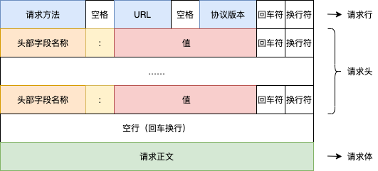

# 4-文件上传与用户鉴权

[toc]


## 1、文件上传的业务场景

除了我们通常提交的文本字符类型的数据，许多时候在应用中还会提交一些其他格式类型的数据，比如：图片、音频、视频等等。

- 用户头像上传
- 网盘文件上传
- ……

## 2、客户端数据提交

无论基于什么客户端环境（如：浏览器、postman、迅雷、或是其它），最基本的也是最重要的就是客户端与服务端之前所使用的 `协议` 。



### 2-1、使用浏览器发送请求

如上所说，发送请求其实就是使用上述的规范格式，链接服务器并提交一些数据（资源）然后得到服务端返回的数据（资源），这些内容包括：

**协议**

数据资源使用什么方式和格式进行交互。

**URL**

数据资源的位置

**请求方法**

针对该数据资源进行何种操作：获取？添加？修改？替换？删除？

**头信息**

针对该资源请求的额外描述说明（元数据）。

**正文**

当对数据进行添加、修改、替换行为的时候需要提交的实际数据。

### 2-2、使用浏览器提交请求

当我们使用浏览器自身提供的地址栏进行请求发送的时候，我们只能设置其中的 `URL` ，其它部分为浏览器默认：

- 请求方法：`GET` 。
- 头信息：浏览器自动设置（不同浏览器会有所差异）。
- 正文：根据 `HTTP` 协议规范定义 `GET` 不能提交正文。

> 通过浏览器的地址栏发送的请求只能为：`GET` 方式的简单请求。

### 2-3、使用 HTML 中的表单提交请求

`HTML` 中的 `表单` 提供了比浏览器本身更多的请求设置。

```html
<form action="/postData" method="post" enctype="application/x-www-form-urlencoded">
  <p>
    姓名：<input type="text" name="username" />
  </p>
  <p>
    <button>提交</button>
  </p>
</form>
```

**action**

请求地址

**method**

请求方法，表单只支持：`GET` 、`POST` 。

**enctype**

请求正文中数据的格式，对应请求头中的：`Content-Type` ，一共有三个值：

- application/x-www-form-urlencoded : url 格式编码的数据，`enctype` 的默认值。
- multipart/form-data : form-data 格式编码的数组（原始数据）- 文件上传时使用。
- text/plain : 纯文本数据。

> 注：
>
> `Content-Type` 中设置的值，只是告知对方数据的类型，但并不表示数据一定是这个格式的。比如：你的数据是通过 `JSON` 这种格式组织的，但是你在 `Content-Type` 设置成 `text/html` 也是可以的，一般接收方式通过 `Content-Type` 来判别类型并调用对应的方式进行解析，所以如果 `Content-Type` 与实际内容格式并不相符，就会导致接收方解析错误。

## 3、webserver 接收并处理提交数据

服务端在接收到请求的时候，实际上会获取到与请求有关的所有数据，`Node.js` 中的 `net` 、`http` 模块都以及封装了对这些数据的解析，并提供了对应的 `API` 来获取它们：

```js
//C3-0
...
server.on('request', (req, res) => {
  console.log('请求方式：', req.method);
  console.log('HTTP协议版本', req.httpVersion);
  console.log('请求URL：', req.url);
  
  console.log('请求头信息：', req.headers);
})
...
```

基于 `HTTP` 标准规范定义的结构，我们通常会用使用如下的方式进行一些客户端与服务端之间的数据交互。

### 3-1、URL

客户端请求的 `URL` 本身就是一种数据。

```js
//C3-1-0
...
server.on('request', async (req, res) => {
  // 当前请求的 URL 就是一组数据，服务端可以根据不同的 URL 数据做不同事情，返回不同的结果
  if (req.url == '/') {
    res.end('index');
  }

  if (req.url == '/register') {
    res.end('register');
  }
  
  // 动态路由
  let dyRouter = /\/item\/(?<id>\d+)/gi.exec(req.url);
  if (dyRouter) {
    let { id } = dyRouter.groups;

    res.end(`id: ${id}`);
  }
});
...
```

```js
// 使用 koa & koa-router
// C3-1-1-1
...
router.get('/item/:id(\d+)', async (ctx, next) => {
  let {id} = ctx.params;
  
  res.end(`id: ${id}`);
})
...
```

#### 3-1-2、QueryString

`QueryString` 是 `URL` 中 `?` 后面的内容，提供给服务端的额外参数，使用 `&` 分隔的 `键/值` 对列表，如：`?key1=value1&key2=value2` 。服务端可以使用这些参数来执行额外的操作。

```js
// C3-1-2-0
...
// http://localhost:8888/items?page=1&limit=5
server.on('request', (req, res) => {
    const u = new URL(`${req.headers.host}${req.url}`);
    const query = u.searchParams;
    console.log(`page: ${query.get('page')} , limit: ${query.get('limit')}`);
});
...
```

```js
// C3-1-2-1
...
// http://localhost:8888/items?page=1&limit=5
router.get('/item', async (ctx, next) => {
  let {page, limit} = ctx.query;
  
  console.log(`page: ${page} , limit: ${limit}`);
})
...
```

> `queryString` 是 `URL` 中的一部分，所以它与请求方法没有关系，也就是：`无论什么方式的请求（GET/POST/PUT/....）都可以有 queryString` 。

### 3-2、正文

`正文` 请求和响应的主要数据。在 `HTTP` 协议标准中，正文数据并不是任何情况下都可以携带的：

> 参考：https://developer.mozilla.org/zh-CN/docs/Web/HTTP/Methods

`正文` 数据往往涉及到的数据会相对比较复杂，所以发送方就需要使用某种格式去组织数据，并通过头信息 `Content-Type` 去告知接收方数据的 `MIME` 类型（组织结构）。

**application/x-www-form-urlencoded**

一种使用 `URLEncode` 进行编码的数据格式，`QueryString` 中使用就是该格式。

> 参考：https://www.eso.org/~ndelmott/url_encode.html

**application/json**

顾名思义，`JSON` 格式。

**text/plain**

如果该数据不需要做任何处理（即使该数据是 `JSON` 结构的），那么就可以通过 `text/plain` 告知接收方。

**multipart/form-data**

以上的一些类型都是建立在字符数据基础上的，还有一些数据不仅仅只包含字符，还会有其它类型的，比如二进制数据等。这是个时候，我们可以把数据通过 `form-data` 进行格式化，并声明 `Content-Type` 为 `multipart/form-data; boundary=随机` 。

> 参考：https://developer.mozilla.org/zh-CN/docs/Web/HTTP/Headers/Content-Type

#### 3-2-1、基于 Node.js 原生的正文解析处理

```js
// C3-2-1-0
const Koa = require('koa');
const KoaRouter = require('koa-router');
const queryString = require('querystring');

const server = new Koa();
const router = new KoaRouter();

// 正文解析中间件
const koaBody = () => {
  return (ctx, next) => {

    return new Promise((resolve, reject) => {
      let data = '';

      // ctx.req => Node.js 中 http 模块的 IncomingMessage 对象
      // data 事件 : 接收数据过程中不断触发
      // chunk : 接收到的二进制buffer数据流
      ctx.req.on('data', async (chunk) => {
        // 把接收到的数据拼接在一起
        data += chunk.toString();
      });

      // end : 数据接收完成触发
      ctx.req.on('end', async () => {
        // ctx.is 是 Koa 中的 Reuqest 对象下封装提供的一个方法，用来验证当前请求中 `Content-Type` 中的值是否为参数中指定的值之一
        // Content-Type: application/json
        // ctx.is(['application/json', 'application/x-www-form-urlencoded']) 返回 application/json
        if (ctx.is('application/json')) {
          // 对数据进行 JSON 解析
          ctx.request.body = JSON.parse(data);
        } else if (ctx.is('application/x-www-form-urlencoded')) {
          // 对数据进行 QueryString+urldecoded 解析
          ctx.request.body = queryString.parse(data);
        } else {
          // 如果没有满足上述处理，则默认使用原始字符串
          ctx.request.body = data;
        }
        // 通过上述解析把解析后的结果保存到 ctx.request.body 中，以供后续中间件调用
        // koa-body 中间件的基本原理也是如此

        resolve();
      });
    }).then((res) => {
      return next();
    })

  }
}

router.post('/user', koaBody(), async (ctx, next) => {
    console.log('body', ctx.request.body);
    ctx.body = 'user';

});

server.use(router.routes());

server.listen(8888);
```

#### 3-2-2、Koa 中间件 koa-body 的使用

在 `koa` 中，可以使用 `koa-body` 中间件来处理正文内容的解析

> 参考：https://www.npmjs.com/package/koa-body

```js
// C3-2-2-0
const Koa = require('koa');
const KoaRouter = require('koa-router');
const koaBody = require('koa-body');

const server = new Koa();
const router = new KoaRouter();

router.post('/user', koaBody({
  // koa-body 配置
}), async (ctx, next) => {
    ctx.body = 'user';
});

server.use(router.routes());

server.listen(8888);
```

**koa-body 配置说明**

- `patchNode` **{Boolean}** Patch request body to Node's `ctx.req`, default `false`

  - 是否把解析处理后的内容存储到 `ctx.req` 属性中，默认为：`false`。

- `patchKoa` **{Boolean}** Patch request body to Koa's `ctx.request`, default `true`

  - 是否把解析处理后的内容存储到 `ctx.request` 属性中，默认为：`true`。

- `jsonLimit` **{String|Integer}** The byte (if integer) limit of the JSON body, default `1mb`

  - 设置 `JSON` 格式数据大小，支持 数字/字符串 两种类型的值，如 `'1kb'` 或 `100`，如果值为数字，则单位为 `byte` ，默认为：`1mb` 。

- `formLimit` **{String|Integer}** The byte (if integer) limit of the form body, default `56kb` 

  - 同 `jsonLimit` ，设置 `application/x-www-form-urlencoded` 值大小，默认 `56kb` 。

- `textLimit` **{String|Integer}** The byte (if integer) limit of the text body, default `56kb`

  - 同 `jsonLimit` ，设置 `text/plain` 值大小，默认 `56kb` 。

- `encoding` **{String}** Sets encoding for incoming form fields, default `utf-8`

  - 设置请求数据编码，默认  `utf-8` 。

- `multipart` **{Boolean}** Parse multipart bodies, default `false`

  - 是否开启对 `multipart/form-data` 数据的解析，默认为 `false` 。

  - > 注：这个默认是 `false` ，所以如果需要使用 `koa-body` 处理 `multipart/form-data` 格式的数据，记得开启此项。

- `urlencoded` **{Boolean}** Parse urlencoded bodies, default `true`

  - 是否开启对 `application/x-www-form-urlencoded` 数据的解析，默认为 `true` 。

- `text` **{Boolean}** Parse text bodies, such as XML, default `true`

  - 是否开启对 `text/plain` 数据的解析，默认为 `true` 。

- `json` **{Boolean}** Parse JSON bodies, default `true`

  - 是否开启对 `applicatin/json` 数据的解析，默认为 `true` 。

- `jsonStrict` **{Boolean}** Toggles co-body strict mode; if set to true - only parses arrays or objects, default `true`

  - 是否启用 `co-body` 的严格解析模式，如果设置为 `true` ，则只处理 `arrays` 和 `objects` ，默认为 `true` 

- `includeUnparsed` **{Boolean}** Toggles co-body returnRawBody option; if set to true, for form encoded and JSON requests the raw, unparsed requesty body will be attached to `ctx.request.body` using a `Symbol`, default `false`

  -  是否把为解析的原始内容附加到 `ctx.request.body` 属性上（`encoded` 和 `json` 的情况下），默认为 `false` 。

- `formidable` **{Object}** Options to pass to the formidable multipart parser

  - 设置文件上传选项，对象格式。
  - `koa-body` 使用了其它第三方库 `node-formidable` 实现文件上传，所以该设置是设置给这个第三方库的。
  - 需要同时设置 `multipart` 选项为 `true` 。

- `onError` **{Function}** Custom error handle, if throw an error, you can customize the response - onError(error, context), default will throw

  -  自定义错误处理函数。

- `parsedMethods` **{String[]}** Declares the HTTP methods where bodies will be parsed, default `['POST', 'PUT', 'PATCH']`.

  - 设置 `koa-body` 将会在哪些 `http` 请求方法下才进行解析，默认为 `['POST', 'PUT', 'PATCH']` 。

**formidable 配置**

>  默认情况下，文件类型的结果保存在 `ctx.request.files` 属性中，非文件类型（字符）的结果保存在 `ctx.request.body` 中。

- `maxFields` **{Integer}** Limits the number of fields that the querystring parser will decode, default `1000`

  - 设置 `queryString` 最大字段数，默认 `1000` 。

- `maxFieldsSize` **{Integer}** Limits the amount of memory all fields together (except files) can allocate in bytes. If this value is exceeded, an 'error' event is emitted, default `2mb (2 * 1024 * 1024)`

  - 设置非文件类型数据最大内容大小，默认 `2mb` 。

- `uploadDir` **{String}** Sets the directory for placing file uploads in, default `os.tmpDir()`

  - 上传文件保存目录。默认为 `os.tmpDir()` 

  - > `os` 为 `Node.js` 内置系统模块，`tmpDir()` 方法用来获取当前系统下的系统临时目录。

- `keepExtensions` **{Boolean}** Files written to `uploadDir` will include the extensions of the original files, default `false`
  
  - 上传后的文件是否保持原文件的后缀（扩展名），默认为 `false` 。
- `hash` **{String}** If you want checksums calculated for incoming files, set this to either `'sha1'` or `'md5'`, default `false`
  - 是否对上传的文件进行指纹校验，默认为 `false` 。
- `multiples` **{Boolean}** Multiple file uploads or no, default `true`
  - 是否支持上传多个文件，默认为 `true` 。
- `onFileBegin` **{Function}** Special callback on file begin. The function is executed directly by formidable. It can be used to rename files before saving them to disk.
  - 文件上传事件回调函数，可以利用该函数与返回值来改变上传后的文件名称（默认上传后的文件会使用 `hash` 来进行命名。

> 参考：https://github.com/node-formidable/formidable


## 4、HTTP中的无状态指的是什么？它又有什么问题？

### 4-1、无状态

所谓的 `状态` ，可以理解为对事务处理的记忆。`无状态` 也就是无 `记忆` 了。如果需要有 `状态` ，则需要在请求中记忆维护请求，这样就会带来负担，同时 `web` 对实时性要求并不像实时聊天，语音视频通话或者游戏那么高，这样就会带来服务器资源的浪费。

当然这样会带来一个问题：`无法处理关联事务`，比如在一些请求中鉴别了用户身份，在下一次请求中就无法识别了。

### 4-2、有会话

`会话` 指的是客户端与服务端的一次通信过程（`session`），虽然 `无状态` 特性不会主动实时的去保存维护 `会话` 的状态，但是，我们可以在每一次 `会话` 中去主动建立一些关联，`HTTP` 中的 `cookie` 机制就可以用来存储和传递这种 `会话状态` 。


## 5、COOKIE 的作用与特性

#### 5-1、创建 cookie

如果我们先建立有 `'状态'` 的会话，需要：

1、当服务端接收到一个需要建立 `状态` 的请求的时候（比如：登录请求） ，服务端可以在返回响应的时候通过 `Set-Cookie` 头选项携带一个能够表示当前这个客户端与服务端的数据（如生成一个唯一的 `sessionID` ）。

2、客户端接收到 `set-cookie` 数据并保存（如 浏览器会自动保存在一个指定的位置）。

3、客户端每次请求都会从指定存储 `cookie` 的位置中查找与当前请求的服务端相关的 `cookie` ，并通过 `Cookie` 请求头发送给服务端。

通过如上方式，就可以在客户端与服务端之间建立所谓的 `'有状态'` 的会话了。

```js
// C5-1-0
const http = require('http');
const queryString = require('querystring');

const server = http.createServer();

server.on('request', (req, res) => {

    res.setHeader('Content-Type', 'text/html;charset=utf-8');

    if (req.url == '/user') {
        let cookies = null;
        try {
            cookies = queryString.parse(req.headers.cookie, '; ');
        } catch (e) {
            res.statusCode = 401;
            res.end('没有权限');
        }
        if (!cookies.user) {
            res.statusCode = 401;
            res.end('没有权限');
        } else {
            res.end('大海和小蕊');
        }
    }

    if (req.method.toLowerCase() == 'post' && req.url == '/login') {
        let user = {
            id: 1,
            username: 'zMouse'
        };
        // 设置cookie
        res.setHeader('Set-Cookie', `user=${JSON.stringify(user)}`);
        // 设置多个cookie
        // res.setHeader('Set-Cookie', ['a=1', 'b=2']);
        res.end('授权成功');
    }
});

server.listen(8888);
```

> 参考：https://developer.mozilla.org/zh-CN/docs/Web/HTTP/Headers/Set-Cookie

## 6、在KOA中使用COOKIE实现用户会话鉴权

```js
// C6-0-0
const Koa = require('koa');
const KoaRouter = require('koa-router');

const server = new Koa();
const router = new KoaRouter();

router.get('/user', async (ctx, next) => {

    let user = null;

    try {
        user = ctx.cookies.get('user');
    } catch (e) {
        ctx.throw(401, '没有权限');
    }

    if (!user) {
        ctx.throw(401, '没有权限');
    } else {
        ctx.body = '大海和小蕊';
    }

});

router.post('/login', async (ctx, next) => {
    let user = {
        id: 1,
        username: 'zMouse'
    };
    // 设置cookie
    ctx.cookies.set('user', JSON.stringify(user));

    // 设置多个cookie
    // ctx.cookies.set('a', 1);
    // ctx.cookies.set('b', 2);

    ctx.body = '授权成功';
})

server.use(router.routes());

server.listen(8888);
```

### 6-1、Koa 下的 Cookie 合法性验证

为了避免 `Cookie` 在客户端或传输过程中被篡改，我们可以引入相关的一些合法性验证方案：

{"id":5,"username":"%E5%BC%A0%E7%8F%8A"}

```js
// C6-1-0
const Koa = require('koa');
const KoaRouter = require('koa-router');

const server = new Koa();
const router = new KoaRouter();

// 生成签名字符串所使用的秘钥
server.keys = ['kkb'];

router.get('/user', async (ctx, next) => {

    let user = null;

    try {
        user = ctx.cookies.get('user', {
          // 是否验证当前cookie的签名正确性
          signed: true
        });
    } catch (e) {
        ctx.throw(401, '没有权限');
    }

    if (!user) {
        ctx.throw(401, '没有权限');
    } else {
        ctx.body = '大海和小蕊';
    }

});

router.post('/login', async (ctx, next) => {
    let user = {
        id: 1,
        username: 'zMouse'
    };
    // 设置cookie
    ctx.cookies.set('user', JSON.stringify(user), {
      // 是否同时生成签名
      signed: true
    });

    // 设置多个cookie
    // ctx.cookies.set('a', 1);
    // ctx.cookies.set('b', 2);

    ctx.body = '授权成功';
})

server.use(router.routes());

server.listen(8888);
```

服务端在发送 `Cookie` 的同时，会根据指定的算法生成一个签名 `HASH` 字符串（如这里，根据当前 `cookie` 的键值+秘钥+sha256）同时发送给客户端。

客户端请求会把 `Cookie` 和 对应的 `HASH` 返回给服务端，后端会再根据客户端发送过来的 `Cookie` 和后端保存的秘钥进行 `HASH` ，把计算的 `HASH` 和通过请求发送过来的 `HASH` 进行对比，这样无论是 `Cookie` 还是发送的 `HASH` 只要被修改过，这两个 `HASH` 就不会一样。从而验证 `Cookie` 是否有被篡改。

> 保护好秘钥！

### 6-2、生命周期

`Cookie` 还可以设置其有效时间，分别对应两种值：

- 会话期（`session`），默认值，如果一个 `Cookie` 的过期时间设置为 `session` ，那么浏览器关闭，该 `session` 就会自动删除。

- 持久期，通过 `Expires` 或 `Max-Age` 指定过期时间

设置方式：

**Expires=<date>**

可选，设置当前 `cookie` 的到期时间，语法：

```js
Set-Cookie: <cookie-name>=<cookie-value>; Expires=<date>
```

**Max-Age=<non-zero-digit>**

可选，在 cookie 失效之前需要经过的秒数。秒数为 0 或 -1 将会使 cookie 直接过期。一些老的浏览器（ie6、ie7 和 ie8）不支持这个属性。对于其他浏览器来说，假如二者 （指 `Expires` 和`Max-Age`） 均存在，那么 Max-Age 优先级更高，语法：

```js
Set-Cookie: <cookie-name>=<cookie-value>; Max-Age=<non-zero-digit>
```

### 6-3、作用域

`Domain` 和 `Path` 标识定义了Cookie的*作用域：*即允许 Cookie 应该发送给哪些URL。语法：

```js
Set-Cookie: <cookie-name>=<cookie-value>; Domain=<domain-value>
Set-Cookie: <cookie-name>=<cookie-value>; Path=<path-value>
```

### 6-4、限制访问

有两种方法可以确保 `Cookie` 被安全发送，并且不会被意外的参与者或脚本访问：`Secure` 属性和`HttpOnly` 属性。

- 标记为 `Secure` 的 `Cookie` 只应通过被 `HTTPS` 协议加密过的请求发送给服务端。
- JavaScript [`Document.cookie`](https://developer.mozilla.org/zh-CN/docs/Web/API/Document/cookie) API 无法访问带有 `HttpOnly` 属性的 `Cookie` ，仅限于 `HTTP` 传输使用。

语法：

```js
Set-Cookie: <cookie-name>=<cookie-value>; Secure
Set-Cookie: <cookie-name>=<cookie-value>; HttpOnly
```

### 6-5、使用案例

```js
Set-Cookie: <cookie-name>=<cookie-value>; Domain=<domain-value>; Secure; HttpOnly
```

> 参考：https://developer.mozilla.org/zh-CN/docs/Web/HTTP/Cookies


## 8、练习：为商城应用添加用户系统